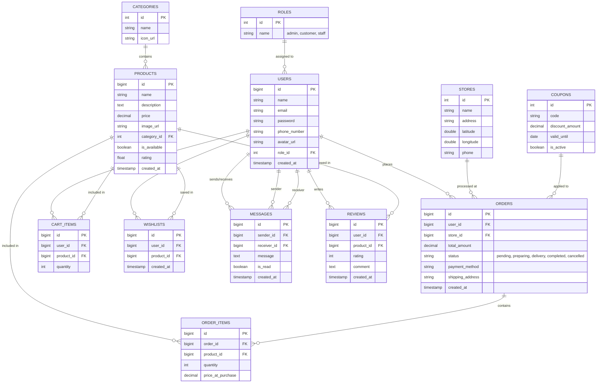

# Database Schema Report for BIJI Coffee Shop Backend

Dokumen ini berisi rancangan skema database untuk aplikasi BIJI Coffee Shop. Skema ini dirancang untuk mendukung fitur utama seperti manajemen pengguna, produk, pesanan (checkout), keranjang belanja, chat, dan lokasi toko.

## Entity Relationship Diagram (ERD)

Berikut adalah visualisasi hubungan antar tabel dalam database:

## Detail Struktur Tabel

### 1. `users`
Menyimpan data pengguna aplikasi.
- **id**: Primary Key, Big Integer, Auto Increment.
- **name**: Nama lengkap pengguna.
- **email**: Email pengguna (Unique).
- **password**: Hash password.
- **phone_number**: Nomor telepon.
- **avatar_url**: URL foto profil (sesuai `profile1.jpg` di data dummy).
- **role_id**: Foreign Key ke tabel `roles`.
- **created_at**: Timestamp pendaftaran.

### 2. `roles`
Mengelola peran pengguna (misal: Customer, Admin, Barista).
- **id**: Primary Key.
- **name**: Nama role (e.g., 'customer', 'admin').

### 3. `categories`
Kategori produk (misal: Coffee, Beverages, Snacks).
- **id**: Primary Key.
- **name**: Nama kategori (e.g., 'Coffee', 'Beverages').
- **icon_url**: URL icon kategori (jika ada).

### 4. `products`
Daftar menu/produk yang dijual.
- **id**: Primary Key.
- **category_id**: Foreign Key ke `categories`.
- **name**: Nama produk (misal: 'White Cream Cappuccino').
- **description**: Deskripsi produk.
- **price**: Harga produk.
- **image_url**: Path/URL gambar produk.
- **is_available**: Status ketersediaan stok.
- **rating**: Rating rata-rata produk.

### 5. `carts` & `cart_items`
Menyimpan barang yang akan dibeli. Bisa digabung menjadi satu tabel `cart_items` jika 1 user hanya punya 1 keranjang aktif.
**Tabel: cart_items**
- **id**: Primary Key.
- **user_id**: Foreign Key ke `users`.
- **product_id**: Foreign Key ke `products`.
- **quantity**: Jumlah barang.
- **created_at**: Timestamp.

### 6. `orders`
Header transaksi pembelian.
- **id**: Primary Key.
- **user_id**: Foreign Key ke `users`.
- **store_id**: Foreign Key ke `stores` (Lokasi toko yang dipilih).
- **coupon_id**: Foreign Key ke `coupons` (Opsional, jika pakai kupon).
- **total_amount**: Total harga final.
- **status**: Status pesanan ('Pending', 'Preparing', 'Delivery', 'Completed', 'Cancelled').
- **payment_method**: Metode pembayaran (e.g., 'Credit Card', 'Cash', 'E-Wallet').
- **shipping_address**: Alamat pengiriman.
- **created_at**: Waktu pemesanan.

### 7. `order_items`
Detail barang dalam setiap pesanan.
- **id**: Primary Key.
- **order_id**: Foreign Key ke `orders`.
- **product_id**: Foreign Key ke `products`.
- **quantity**: Jumlah barang.
- **price_at_purchase**: Harga saat dibeli (untuk history jika harga produk berubah).

### 8. `messages`
Fitur chat antara Customer dan Staff/Driver.
- **id**: Primary Key.
- **sender_id**: Foreign Key ke `users`.
- **receiver_id**: Foreign Key ke `users`.
- **message**: Isi pesan teks.
- **is_read**: Status terbaca.
- **created_at**: Waktu pesan dikirim.

### 9. `stores`
Data lokasi-lokasi toko (cabang).
- **id**: Primary Key.
- **name**: Nama toko/cabang.
- **address**: Alamat lengkap.
- **latitude**: Koordinat Maps.
- **longitude**: Koordinat Maps.
- **phone**: Nomor telepon toko.

### 10. `wishlists`
Produk favorit pengguna.
- **id**: Primary Key.
- **user_id**: Foreign Key ke `users`.
- **product_id**: Foreign Key ke `products`.

### 11. `coupons`
Data promo atau diskon.
- **id**: Primary Key.
- **code**: Kode unik kupon (e.g., 'BIJI50').
- **discount_amount**: Nominal atau persentase potongan.
- **valid_until**: Tanggal kadaluarsa.
- **is_active**: Status aktif/non-aktif.

### 12. `reviews`
Ulasan pengguna terhadap produk.
- **id**: Primary Key.
- **user_id**: FK `users`.
- **product_id**: FK `products`.
- **rating**: Nilai bintang (1-5).
- **comment**: Komentar teks.

---

## Catatan Implementasi (Backend Laravel)
Jika Anda menggunakan Laravel sebagai backend, Anda dapat membuat migration dengan perintah:
`php artisan make:model Product -m`
`php artisan make:model Order -m`
dst.

Pastikan relasi di Model (`hasMany`, `belongsTo`) didefinisikan sesuai dengan ERD di atas.
